# 🎲 D20 Dice Roller Simulation with PIC16F877A & KS0108 GLCD

**A microcontroller-based interactive dice roller with full Proteus simulation**  
Features **40×40 pixel animations**, **musical feedback**, and **hardware-accurate implementation** of a 20-sided dice system.

[](https://opensource.org/licenses/MIT)  
  
  

---

## ✨ Key Features
- **Animated D20 simulation** with 20 rapid rolls before final result
- **128×64 KS0108 GLCD** display with custom bitmap rendering
- **Multi-layer audio system**:
  - 2N2222-driven buzzer with flyback protection
  - Für Elise melody playback via PWM timing
- **Debounced input** using RB6 tactile switch
- **Proteus-ready** design with virtual instrumentation support

---

## 🛠 Hardware Implementation


### Core Schematic

| **Component**       | **Specification**                       | **Pin Mapping/Connection**          |
|----------------------|-----------------------------------------|---------------------------------------|
| **PIC16F877A**       | 8-bit MCU @ 20 MHz (HS Mode)           | - OSC1/OSC2: Pins 13-14 (Crystal)<br>- PORTD: RD0-RD7 (GLCD Data Bus)<br>- PORTB: RB0-RB7 (Control Signals) |
| **KS0108 GLCD**      | 128×64 Graphic Display                  | - RS: RB0<br>- RW: RB1<br>- E: RB2<br>- CS1: RB3<br>- CS2: RB4<br>- RST: RB5<br>- Data Bus: PORTD (RD0-RD7)<br>- VO: RV1<br>- VOUT: RV1 |
| **Buzzer Circuit**   | Passive Buzzer + 2N2222 Driver          | - RB7 → 470Ω (R2) → 2N2222 Base<br>- Collector: Buzzer + 1N4001 Flyback Diode<br>- Emitter: GND |
| **Roll Button**      | Tactile Switch (Debounced)              | - RB6 → 10kΩ Pull-up (R1)<br>- Switch to GND |
| **Oscillator**       | 20 MHz Crystal + 22 pF Capacitors       | - X1: 20 MHz Crystal<br>- C1/C2: 22 pF Ceramic Caps (GND) |
| **Power System**     | 5V Regulated Supply                     | - 100nF Decoupling Caps (VCC-GND)<br>- RV1: 10kΩ GLCD Contrast Pot |

---

### Key Circuit Details:
1. **GLCD Interface**  
   - **Control Signals**: Mapped to PORTB (RB0-RB5)  
   - **Data Bus**: Full 8-bit parallel connection via PORTD  
   - **Reset Circuit**: Hardware reset via RB5 (Active High)  

2. **Buzzer Protection**  
   - **Transistor**: 2N2222 NPN (Q1) with 470Ω base resistor (R2)  
   - **Flyback Diode**: 1N4001 (D1) across buzzer terminals  

3. **Clock Accuracy**  
   - 20 MHz crystal (X1) with 22 pF capacitors (C1/C2)  
   - HS oscillator mode configured via `#pragma config FOSC = HS`  

4. **User Input**  
   - Debounced button on RB6 with hardware pull-up (R1 = 10kΩ)  

---

## 💻 Software Architecture

### **Layered Architecture**  
```plaintext
┌────────────────────────┐
│      Application       │  ► Core logic & animation control
├────────────────────────┤
│       Services         │  ► GLCD rendering, audio management
├────────────────────────┤
│ Hardware Abstraction   │  ► KS0108 commands, buzzer timing
├────────────────────────┤
│    MCU Peripherals     │  ► Port I/O, clock configuration
└────────────────────────┘
```

---

### **1. Hardware Abstraction Layer (HAL)**  
#### `glcd_driver.c/h`  
- **Low-Level Operations**:  
  ```c
  void glcd_write_command(uint8_t cmd);     // Direct KS0108 communication
  void glcd_set_page(uint8_t page);         // Vertical positioning (0-7)
  void glcd_set_column(uint8_t col);        // Horizontal positioning (0-63)
  ```
- **Key Features**:  
  - Dual-chip control for 128-pixel width  
  - Hardware reset sequence with precise timing  
  - Page-based memory addressing for efficient updates  

#### `audio.c/h`  
- **Precision Sound Generation**:  
  ```c
  void beep(uint16_t freq, uint16_t duration_ms);  // Frequency-accurate tones
  ```
  - Cycle-exact delays using `__delay_us()`  
  - Automatic muting during REST notes  

---

### **2. Service Layer**  
#### **GLCD Service Module**  
- **Graphic Rendering**:  
  ```c
  void glcd_draw_bitmap(uint8_t x, uint8_t yPage, uint8_t w, uint8_t h, const uint8_t *data);
  ```
  - Handles 40×40 dice sprites from `dice_bitmaps.h`  
  - Automatic chip selection for cross-screen elements  

- **Text Engine**:  
  ```c
  void glcd_puts(const char *str);          // 5×7 bitmap font renderer
  ```
  - Dynamic centering algorithm:  
    ```c
    xCenter = x + 20 - (strlen(str)*6)/2;  // 6px/character width
    ```

#### **Audio Service Module**  
- **Musical Playback System**:  
  ```c
  void play_sonata(void);                   // Tempo-controlled melody
  ```
  - Duration calculator:  
    ```c
    const int wholenote = (60000 * 4) / TEMPO;  // TEMPO = 114 BPM
    uint16_t noteDuration = wholenote / noteType;
    ```
  - Supports dotted notes via negative duration values  

---

### **3. Application Layer** (`main.c`)  
#### **State Machine Workflow**  
```c
while(1) {
    // Idle state
    if (button_pressed()) {
        // Animation sequence
        for (uint8_t i=0; i<20; i++) {
            roll_dice();
            update_display();
            beep(2000, 50);  // 2kHz feedback
        }
        
        // Final display
        show_results();
        play_melody();
    }
}
```

#### **Core Algorithms**  
1. **Randomized Roll Generation**:  
   ```c
   srand(1);                              // Fixed seed for consistency
   uint8_t value = (rand() % 20) + 1;     // D20 range (1-20)
   ```
2. **Animation Controller**:  
   - 20-frame animation @ 50ms/frame (1s total duration)  
   - Frame-synchronized display updates  

---

### **4. Data Layer**  
#### `music.h`  
- **Sound Database**:  
  ```c
  #define NOTE_B0  31   // B0 = 31 Hz
  #define NOTE_C4  262  // Middle C = 262 Hz
  /* ... 100+ notes ... */
  ```
- **Musical Sequence**:  
  ```c
  const Note sonata[] = {
      {NOTE_E4, wholenote/4}, 
      {NOTE_E4, wholenote/4},
      // ... 32-note arrangement ...
  };
  ```

#### `dice_bitmaps.h`  
- **Graphic Assets**:  
  ```c
  static const uint8_t dice_bitmap_40x40[200] = {
      0x00, 0xFC, 0xFF, 0x3F, 0x00,  // 40×40px 1bpp pattern
      // ... 196 more bytes ...
  };
  ```

---

### **Component Interaction**  

```mermaid
sequenceDiagram
    Main Loop->>Button: Poll RB6
    Button-->>Animation: Start 20-roll sequence
    Animation->>GLCD: Update dice bitmap
    Animation->>Buzzer: Play 2kHz beep
    Animation->>RNG: Get new dice value
    loop 20 times
        GLCD-->>Display: Render frame
        Buzzer-->>Audio: Generate tone
    end
    Audio->>Melody: Play Für Elise
```


---

### **Key Design Features**  
1. **Hardware-Independent Timing**:  
   - `software_us_delay()` enables Proteus simulation compatibility  
   - Avoids hardware timer dependencies  

2. **Memory Optimization**:  
   - Bitmaps stored in flash via `const` declaration  
   - On-the-fly font rendering minimizes RAM usage  

3. **Musical Fidelity**:  
   - Integer-based duration calculations (no floating point)  
   - 90%/10% note/rest ratio for articulation

---

## 🗂 Project Structure
```
DICE_ROLLER/
├── Proteus/
│   ├── DICE_ROLLER_LCD_PIC.pdsprj    # Simulation project
│   └── DICE_ROLLER_LCD_PIC.PDF       # Full schematic
├── Firmware/
│   └── DICE_PIC.X.production.hex     # Precompiled binary
└── src/
    ├── drivers/                      # Hardware abstraction
    │   ├── glcd_driver.c             # KS0108 low-level ops
    │   └── audio.c                   # Buzzer tone generation
    └── application/                  # Business logic
        ├── main.c                    # Core program flow
        └── music.h                   # Melody definitions
```

---

## 🎛 Proteus Simulation Guide

### Key Simulation Features
- **Virtual Instruments**:
  - Logic analyzer: GLCD control signals
  - Audio mixer: Buzzer output waveform
  - Voltage probe: Button debounce analysis

### Setup Process
1. Import `DICE_ROLLER_LCD_PIC.pdsprj`
2. Program PIC16F877A with provided HEX file:
   ```bash
   Right-click MCU → Edit Properties → Load Firmware
   ```
3. Configure simulation settings:
   - CPU Frequency: 20.000MHz
   - GLCD Contrast: Adjust RV1 potentiometer

---

## 📊 Performance Metrics

| **Parameter**         | **Value**          | **Implementation Basis**       |
|------------------------|--------------------|---------------------------------|
| GLCD Refresh Rate      | 45 FPS             | Page-based column writes        |
| Buzzer Frequency Range | 31Hz - 4.8kHz      | `__delay_us()` resolution       |
| Button Debounce        | 20ms               | Software counter in main loop   |
| Roll Animation         | 20 cycles @ 50ms   | `for(uint8_t i=0; i<20; i++)`   |

---

## 🎶 Audio Implementation

```c
// From audio.c - Hardware-accurate timing
void beep(uint16_t freq, uint16_t duration_ms) {
    uint32_t period_us = 1000000UL / freq;
    uint32_t cycles = duration_ms * 1000UL / period_us;
    
    while(cycles--) {
        BUZZER = 1;
        software_us_delay(period_us/2);
        BUZZER = 0; 
        software_us_delay(period_us/2);
    }
}
```

---

## 📚 Documentation Resources
1. [PIC16F877A Datasheet](https://ww1.microchip.com/downloads/en/devicedoc/39582b.pdf)  
2. [KS0108 Command Set](https://www.sparkfun.com/datasheets/LCD/KS0108.pdf)  
3. [Proteus VSM Tutorial](https://www.labcenter.com/simulation/)  

---

## ⚖️ License
MIT Licensed - Full details in [LICENSE](LICENSE)

---

**Developers Welcome!**  
🐛 [Report Issues](https://github.com/yourrepo/issues)  
💡 [Suggest Features](https://github.com/yourrepo/discussions)  
🛠 [Submit PRs](https://github.com/yourrepo/pulls)

---
